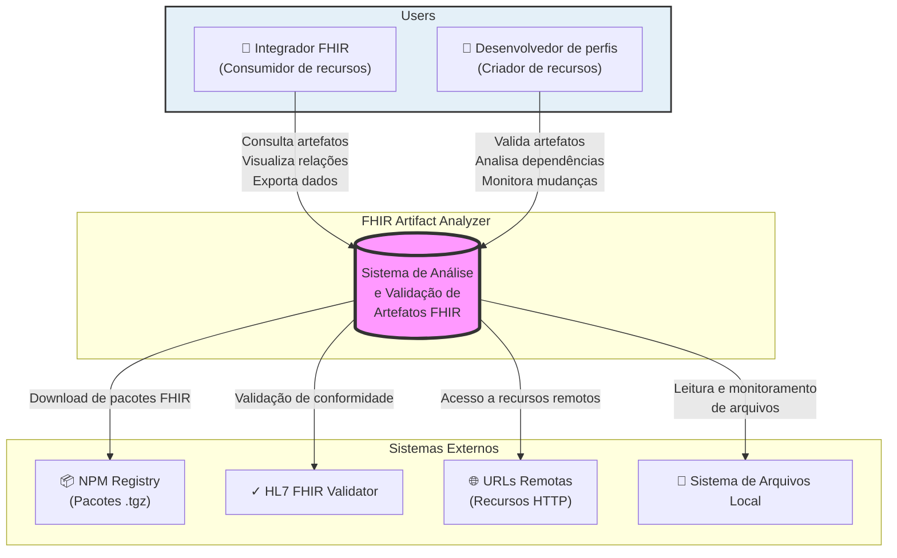

# Visão de contexto

```mermaid
flowchart TB
    subgraph Users
        integrator["👤 Integrador FHIR<br>(Consumidor de recursos)"]
        profileDev["👤 Desenvolvedor de perfis<br>(Criador de recursos)"]
    end

    subgraph "FHIR Artifact Analyzer"
        faa[("Sistema de Análise<br>e Validação de<br>Artefatos FHIR")]
    end

    subgraph "Sistemas Externos"
        npmReg["📦 NPM Registry<br>(Pacotes .tgz)"]
        validator["✓ HL7 FHIR Validator"]
        remote["🌐 URLs Remotas<br>(Recursos HTTP)"]
        files["💾 Sistema de Arquivos Local"]
    end

    integrator -->|"Consulta artefatos<br>Visualiza relações<br>Exporta dados"| faa
    profileDev -->|"Valida artefatos<br>Analisa dependências<br>Monitora mudanças"| faa

    faa -->|"Download de pacotes FHIR"| npmReg
    faa -->|"Validação de conformidade"| validator
    faa -->|"Acesso a recursos remotos"| remote
    faa -->|"Leitura e monitoramento<br>de arquivos"| files

    style faa fill:#f9f,stroke:#333,stroke-width:4px
    style Users fill:#e4f0f8,stroke:#333,stroke-width:2px
```