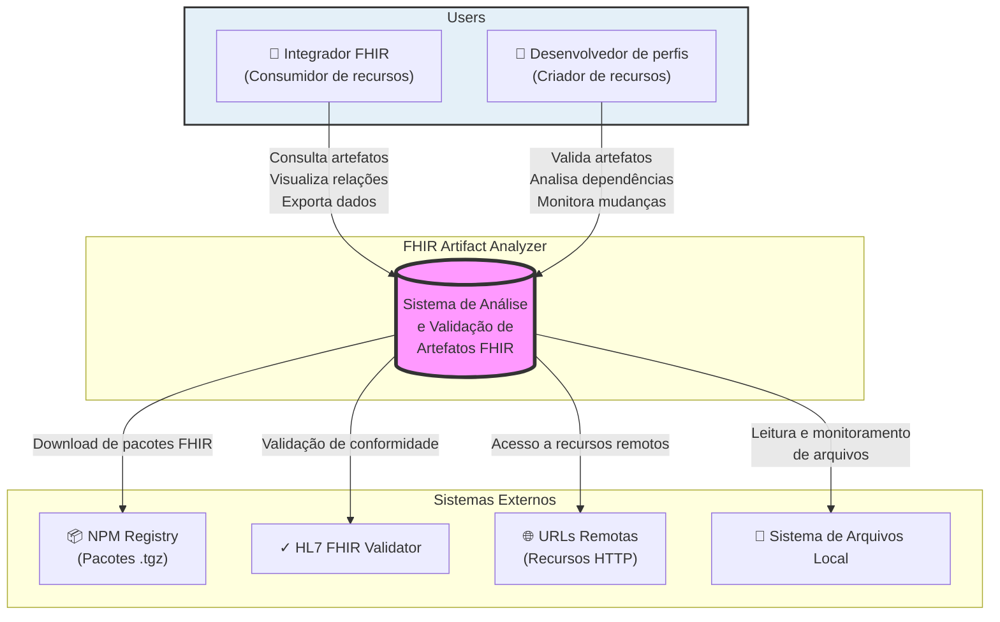
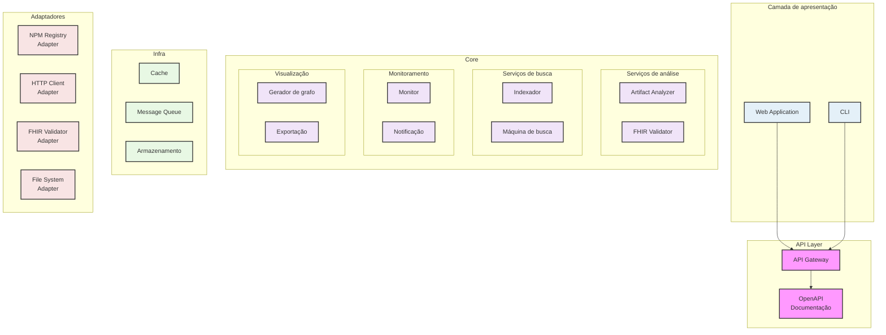

# Visão de contexto

```mermaid
flowchart TB
    subgraph Users
        integrator["👤 Integrador FHIR<br>(Consumidor de recursos)"]
        profileDev["👤 Desenvolvedor de perfis<br>(Criador de recursos)"]
    end

    subgraph "FHIR Artifact Analyzer"
        faa[("Sistema de Análise<br>e Validação de<br>Artefatos FHIR")]
    end

    subgraph "Sistemas Externos"
        npmReg["📦 NPM Registry<br>(Pacotes .tgz)"]
        validator["✓ HL7 FHIR Validator"]
        remote["🌐 URLs Remotas<br>(Recursos HTTP)"]
        files["💾 Sistema de Arquivos Local"]
    end

    integrator -->|"Consulta artefatos<br>Visualiza relações<br>Exporta dados"| faa
    profileDev -->|"Valida artefatos<br>Analisa dependências<br>Monitora mudanças"| faa

    faa -->|"Download de pacotes FHIR"| npmReg
    faa -->|"Validação de conformidade"| validator
    faa -->|"Acesso a recursos remotos"| remote
    faa -->|"Leitura e monitoramento<br>de arquivos"| files

    style faa fill:#f9f,stroke:#333,stroke-width:4px
    style Users fill:#e4f0f8,stroke:#333,stroke-width:2px
```

# Visão de componentes

```mermaid
flowchart TB
    subgraph "Camada de apresentação"
        direction LR
        webApp["Web Application"]
        cliApp["CLI"]
    end

    subgraph "API Layer"
        direction LR
        apiGateway["API Gateway"]
        apiDocs["OpenAPI<br>Documentação"]
    end

    subgraph "Core"
        direction TB
        subgraph "Serviços de análise"
            analyzer["Artifact Analyzer"]
            validator["FHIR Validator"]
        end

        subgraph "Serviços de busca"
            indexer["Indexador"]
            search["Máquina de busca"]
        end

        subgraph "Monitoramento"
            monitor["Monitor"]
            notifier["Notificação"]
        end

        subgraph "Visualização"
            desenho["Gerador de grafo"]
            export["Exportação"]
        end
    end

    subgraph "Infra"
        direction LR
        cache["Cache"]
        queue["Message Queue"]
        storage["Armazenamento"]
    end

    subgraph "Adaptadores"
        direction LR
        npmAdapter["NPM Registry<br>Adapter"]
        httpAdapter["HTTP Client<br>Adapter"]
        fhirAdapter["FHIR Validator<br>Adapter"]
        fsAdapter["File System<br>Adapter"]
    end

    webApp & cliApp --> apiGateway
    apiGateway --> apiDocs


    %% Styling
    classDef frontend fill:#e4f0f8,stroke:#333,stroke-width:2px
    classDef api fill:#f9f,stroke:#333,stroke-width:2px
    classDef core fill:#f0e4f8,stroke:#333,stroke-width:2px
    classDef infra fill:#e8f8e4,stroke:#333,stroke-width:2px
    classDef adapter fill:#f8e4e4,stroke:#333,stroke-width:2px

    class webApp,cliApp frontend
    class apiGateway,apiDocs api
    class analyzer,validator,indexer,search,monitor,notifier,desenho,export core
    class cache,queue,storage infra
    class npmAdapter,httpAdapter,fhirAdapter,fsAdapter adapter
```