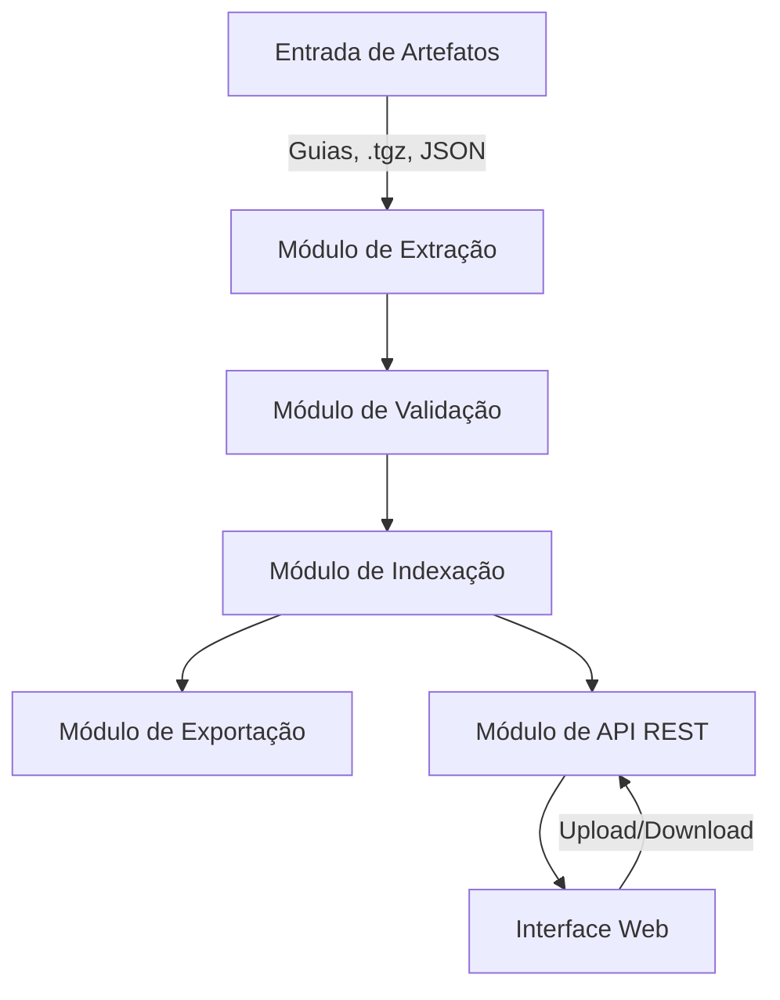
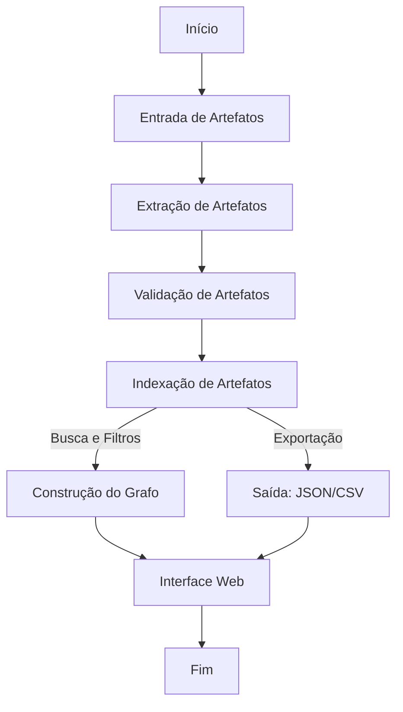

# FHIR Artifact Analyzer

## 1. Visão geral
O **FHIR Artifact Analyzer** é uma ferramenta para identificar, validar e facilitar a consulta acerca de artefatos do padrão FHIR (versão 4.0.1). Estes artefatos podem estar disponibilizadas em uma entrada definida por um conjunto formado por guias de implementação (arquivos .tgz), diretórios e inclusive arquivos, quaisquer um deles disponível localmente ou não.

As funcionalidas oferecidas deverão ser exploradas por meio de duas interfaces, uma via linha de comandos e outra via interface gráfica (web). Os artefatos relevantes são aqueles que são instâncias dos seguintes recursos FHIR: (a) `StructureDefinition`; (b) `CodeSystem`, (c) `ValueSet`, (d) `CapabilityStatement`; (e) `ImplementationGuide`; (f) `OperationDefinition` e (g) `SearchParameter`.

_Contexto_. O uso do FHIR é registrado por artefatos em um Guia de Implementação, geralmente um NPM Package (.tgz). Também é possível
que tais artefatos sejam fornecidos em um diretório contendo os arquivos JSON ou até identificados unicamente, arquivo por arquivo. Cada arquivo, 
seja identificado individualmente, contido em um diretório ou arquivo .tgz define um recurso FHIR. Adicionalmente, instâncias de recursos FHIR formam um grafo, 
pois há várias formas de estabelecer [relações](https://www.hl7.org/fhir/R4/references.html) entre elas. Nesse contexto é "fácil se perder", pois são muitos recursos, 
dos mais variados tipos e relações entre eles. Este projeto visa criar uma ferramenta
para facilitar a navegação entre estes artefatos tanto para integradores (consumidores)
quanto para aqueles responsáveis pela criação de perfis FHIR.

O padrão FHIR, versão 4.0.1, está disponível [AQUI](https://hl7.org/fhir/R4/index.html).

## 2. Objetivos
- **Identificar**: localizar todos os artefatos FHIR contidos na entrada fornecida, como guias de implementação, pacotes `.tgz`, arquivos JSON e outras formas.
- **Validar**: Verificar URLs canônicas e conformidade com o padrão FHIR 4.0.1, inclusive duplicidades e outros. 
- **Organizar**: indexar os artefatos para busca eficiente e geração de grafos dirigidos, além de dados estatísticos.
- **Visualizar**: fornecer uma interface via linha de comandos e outra web para explorar os artefatos e suas relações.
- **Exportar**: permitir a exportação dos resultados em formatos JSON e CSV e PNG (grafos).

## 3. Funcionalidades principais

### 3.1 Identificação da entrada

#### 3.1.1 Tipos de entrada
- **Pacotes NPM (.tgz)**
  - Tamanho máximo: 100MB
  - Timeout para download: 30 segundos

- **Arquivos ZIP**
  - Tamanho máximo: 100MB

- **Diretórios**
  - Profundidade máxima de varredura: 5 níveis
  - Limite de arquivos: 1.000 por diretório
  - Tipos de arquivo ignorados: .git, node_modules, .xml e outros.

- **Arquivos individuais**
  - Formato: apenas JSON.
  - Tamanho máximo por arquivo: 10MB
  - Encoding: UTF-8

#### 3.1.2 Expressões Regulares
- Sintaxe: ECMAScript 2018
- Case-sensitive por padrão
- Timeout máximo de execução: 1 segundo
- Exemplos de padrões válidos:
  - `\.json$` - arquivos JSON
  - `(StructureDefinition|ValueSet).*\.json$` - instâncias de recursos específicos

#### 3.1.3 Monitoramento de mudanças
- Intervalo de verificação:
  - Recursos locais: a cada 3 segundos
  - Recursos remotos: a cada 30 segundos
- Detecção de mudanças:
  - Metadados (data de modificação)
- Tentativa de acesso a recursos remotos:
  - 3 tentativas 
  - Timeout: 10 segundos por tentativa

#### 3.1.4 Metadados extraídos
- Identificação do recurso:
  - URL canônica
  - Tipo de recurso
  - Versão
- Informações do arquivo:
  - Path/URL
  - Tamanho
  - Última modificação

#### 3.1.5 Esclarecimentos adicionais
  - Pacotes `.tgz` (NPM Package), por exemplo, `http://hl7.org/fhir/us/core/package.tgz`.
  - Arquivos .zip contendo artefatos, seja um arquivo disponível localmente ou acessível via URL de acesso público.
  - Diretórios (e possivelmente subdiretórios). Por exemplo, pode-se indicar um diretório e, adicionalmente, que os subdiretórios deste diretório devem ser consultados.
  - Arquivos individuais identificados, por exemplo, *x.json* e *c:\teste\y.json*. Arquivos podem ser locais ou estarem disponíveis remotamente.
  - Quando arquivos forem fornecidos como entrada, deve ser possível fornecer expressões regulares para indicar os arquivos relevantes para serem considerados.
- Estes itens de entrada identificam arquivos cujos conteúdos são instâncias de recursos FHIR serializados em JSON. Em particular, os recursos FHIR relevantes estão restritos a: (a) `StructureDefinition`; (b) `CodeSystem`, (c) `ValueSet`, (d) `CapabilityStatement`; (e) `ImplementationGuide`; (f) `OperationDefinition` e (g) `SearchParameter`. Observe que a entrada pode conter instâncias de outros recursos distintos destes considerados relevantes e, neste caso, tais instâncias podem ser simplesmente ignoradas. 
- Arquivos contendo instâncias relevantes deverão ser carregados e do conteúdo extraído metadados para apoiar as demais funcionalidades. Por exemplo, cada arquivo tem um nome, tem o tipo do recurso nele contido, por exemplo, `StructureDefinition` (dentre aqueles identificados acima), e assim por diante.
- A entrada deve ser monitorada periodicamente por mudanças. Na ocorrência de uma mudança, o conteúdo correspondente deve ser recarregado para refletir a atualização no conteúdo. 
  - Caso a entrada seja remota, periodicamente mudanças deverão ser verificadas, provavelmente por meio de uma requisição (HTTP HEAD) com o header `Last-Modified`.
  - Caso a entrada seja local, arquivo ou diretório, `fs.watch` (NodeJS) e `Watchservice` (Java) ilustram bibliotecas que podem ser empregadas, dentre outras opções usando outras linguagens. 

### 3.2 Validação
- URLs Canônicas:
  - Verificar se as URLs canônicas estão acessíveis. Isto pode ser feito via requisição HEAD (http) seguida da verificação de `Content-Type` e `Content-Length`, por exemplo.
- Referências
  - Verificar se referências literais (Reference.reference) contidas (internas), relativas ou absolutas estão acessíveis (incluir validação sintática).
  - Verificar se referências literais (Reference.reference) urn:oid e urn:uuid são sintaticamente válidas e se estão acessíveis.
  - Verificar se referência lógica (Reference.identifier) está acessível (caso seja URL).
- Conformidade com FHIR:
  - Validar a estrutura dos artefatos usando o HL7 FHIR Validator.

### 3.3 Busca e Filtros
- Busca global por nome ou sequência de caracteres a ser encontrada no nome dos artefatos, url canônica, comentários, descrições e ou outros elementos relevantes.
- Filtros por:
  - Tipo de artefato.
  - Status de validação.
  - Referências (artefatos referenciados ou referenciadores).

### 3.4 Visualização de Grafo e estatísticas

- Algumas estatísticas relevantes:
  - Total de artefatos por tipo (recurso)
  - Total de artefatos
  - Total de falhas (conforme validações)
- Exibir as relações entre artefatos em um grafo dirigido. Instâncias de recursos FHIR estão ligadas a outras por meio de vários tipos: (a) canonical; (b) uri e (c) [Reference](https://www.hl7.org/fhir/R4/references.html#Reference). Noutras palavras, nas instâncias dos recursos "relevantes", já identificados, `StructureDefinition` e outros, os elementos destes tipos devem ser utilizados para formar o grafo a ser exibido. 
- Permitir interatividade:
  - Zoom, pan, seleção para destaque de nós (centralizar) e de conexões.
  - Aplicação de filtros no grafo.

### 3.5 Exportação
- Gerar resultados em:
  - **JSON**: estrutura completa dos metadados.
  - **CSV**: dados tabulares para análise simples.
  - **PNG**: grafo exibido

## 4. Arquitetura do Sistema
### 4.1 Diagrama de Arquitetura Geral

### 4.2 Componentes Principais
1. **Backend**:
   - Linguagem: Java (Spring Boot).
   - Módulos:
     - Extração.
     - Validação.
     - Indexação.
     - Exportação.
     - API REST.
2. **Frontend**:
   - Linguagem: JavaScript/TypeScript.
   - Frameworks:
     - React (interface gráfica).
     - D3.js (visualização de grafos).
3. **Armazenamento**:
   - Local: Arquivos temporários.
   - Nuvem: Banco de dados leve (opcional).

## 5. Fluxo de Processamento
### 5.1 Diagrama de Fluxo

### 5.2 Descrição do Fluxo
1. **Entrada**:
   - O usuário fornece os artefatos (localmente ou via interface web).
2. **Extração**:
   - Identificação e classificação dos artefatos.
3. **Validação**:
   - Verificação de URLs e conformidade com o padrão FHIR.
4. **Indexação**:
   - Organização dos metadados e mapeamento de relações.
5. **Construção do Grafo**:
   - Representação das relações entre artefatos.
6. **Saída**:
   - Geração de arquivos JSON e CSV.
7. **Interface Web**:
   - Exibição interativa dos resultados.

## 6. Requisitos não funcionais
- **Desempenho**:
  - Suportar até 10.000 artefatos (~50 MB de dados).
  - Processamento síncrono em tempo real.
- **Internacionalização**:
  - Pronto para múltiplos idiomas (ex.: `en`, `pt`).
- **Portabilidade**:
  - Compatível com execução local e em nuvem.
- **Usabilidade**:
  - Interface intuitiva com feedback visual.

