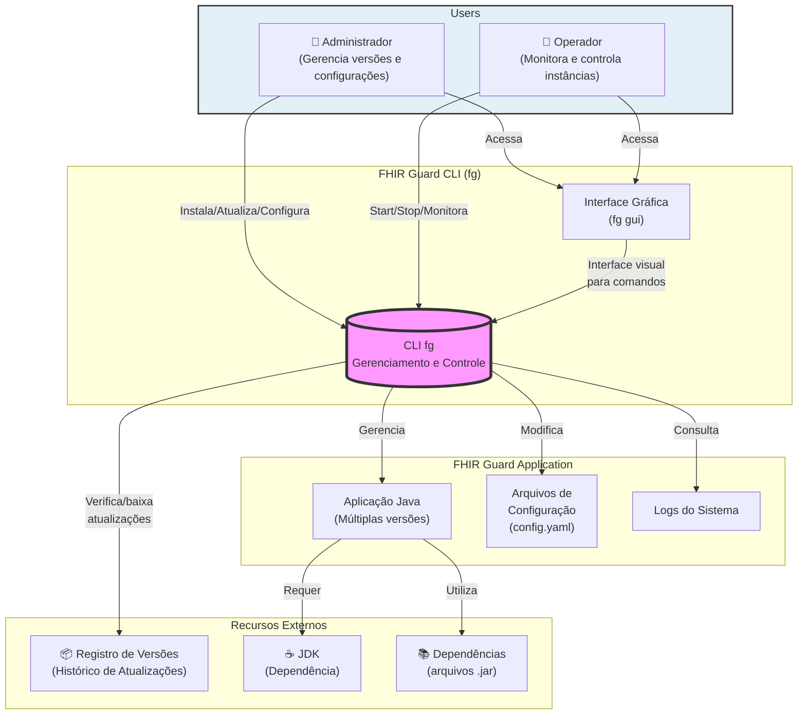

# Visão de contexto

```mermaid
flowchart TB
    subgraph Users
        admin["👤 Administrador<br>(Gerencia versões e configurações)"]
        operator["👤 Operador<br>(Monitora e controla instâncias)"]
    end

    subgraph "FHIR Guard CLI (fg)"
        cli[("CLI fg<br>Gerenciamento e Controle")]
        gui["Interface Gráfica<br>(fg gui)"]
    end

    subgraph "FHIR Guard Application"
        fgApp["Aplicação Java<br>(Múltiplas versões)"]
        config["Arquivos de<br>Configuração<br>(config.yaml)"]
        logs["Logs do Sistema"]
    end

    subgraph "Recursos Externos"
        registry["📦 Registro de Versões<br>(Histórico de Atualizações)"]
        jdk["☕ JDK<br>(Dependência)"]
        deps["📚 Dependências<br>(arquivos .jar)"]
    end

    admin -->|"Instala/Atualiza/Configura"| cli
    operator -->|"Start/Stop/Monitora"| cli
    admin & operator -->|"Acessa"| gui

    cli -->|"Gerencia"| fgApp
    cli -->|"Modifica"| config
    cli -->|"Consulta"| logs
    gui -->|"Interface visual<br>para comandos"| cli

    cli -->|"Verifica/baixa<br>atualizações"| registry
    fgApp -->|"Requer"| jdk
    fgApp -->|"Utiliza"| deps

    style cli fill:#f9f,stroke:#333,stroke-width:4px
    style Users fill:#e4f0f8,stroke:#333,stroke-width:2px
```