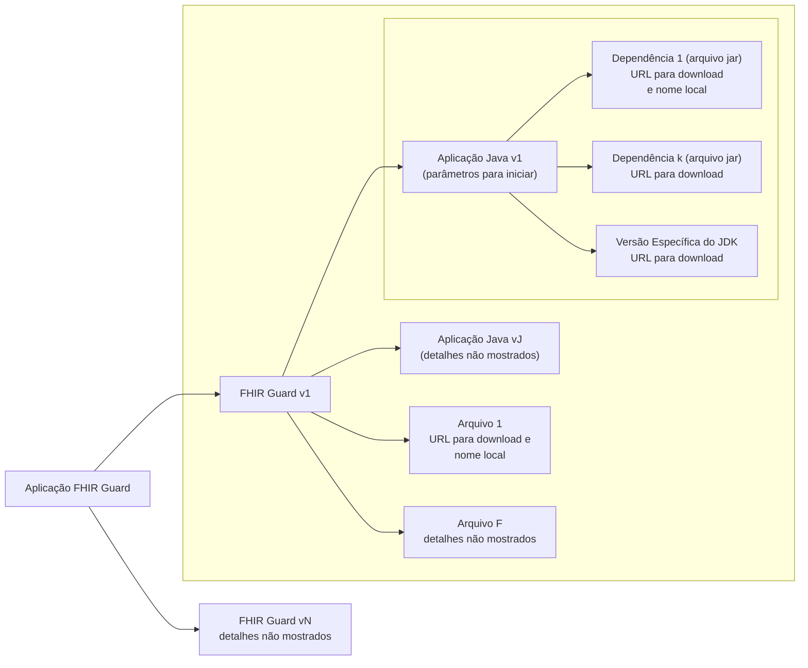

# Documentação do FHIR Guard (fg)

## Visão geral
A interface de linha de comando (CLI) `fg` é uma ferramenta para gerenciar 
e executar a aplicação FHIR Guard. Ela fornece uma interface consistente 
e fácil de usar para instalar, atualizar, iniciar, parar e monitorar 
diferentes versões desta aplicação. Por padrão, o `fg` opera no modo CLI, 
mas uma interface gráfica pode ser iniciada usando o comando `gui`.

## Primeiros passos
Referência rápida para operações comuns:

1. Instalar a versão mais recente (caso já não esteja disponível): `fg update`
2. Iniciar a aplicação: `fg start`
3. Verificar status: `fg status`
4. Visualizar logs: `fg logs [pid]`
5. Parar aplicação: `fg stop [pid]`

## Requisitos de operação
- Sistema operacional suportado (versões mais recentes de): Windows, macOS, Linux
- Mínimo de RAM: 2GB
- Armazenamento: 1GB
- Rede: acesso HTTP(S) de saída

## Opções globais
- `--dir string`: especifica o diretório de trabalho (também pode ser definido através da variável de ambiente `FG_HOME`).
  - Se `FG_HOME` não estiver definida e `--dir` não for um parâmetro fornecido, o diretório padrão será o diretório `.fg` no diretório *home* do usuário.
- `--log-level string`: Define o nível de log para o CLI `fg` (`debug`, `info`, `warn`, `error`).
  - Também pode ser definido através da variável de ambiente `FG_LOG_LEVEL`.
- `--help, -h`: Exibe informações de ajuda para qualquer comando.

### Variáveis de ambiente

| Variável de Ambiente | Descrição |
|---------------------|-----------|
| `FG_HOME` | Define o diretório de trabalho padrão. Se não definida, o diretório padrão será `.fg` no diretório *home* do usuário. |
| `FG_LOG_LEVEL` | Define o nível de log. Valores aceitos: `debug`, `info`, `warn`, `error`. |

O diretório home do usuário pode ser identificado usando os comandos abaixo:

| Sistema Operacional | Comando para Exibir o Diretório Home do Usuário |
|------------------|------------------------------------------|
| **Linux**        | `echo $HOME`                             |
| **macOS**        | `echo $HOME`                             |
| **Windows**      | `echo %USERPROFILE%`                     |

## Comandos

### Comandos básicos

#### `fg available`
- Lista todas as versões disponíveis, independentemente do que está instalado localmente. Depende de acesso à internet para recuperação de arquivo contendo a descrição das versões disponíveis.
- Mostra as versões e, para cada uma delas, a data de lançamento.

Exemplo de saída:

```plaintext
Versão      Data        JDK
------      ----------  ---
2.0.0       2024-04-05  24
1.2.0       2024-03-10  17
1.1.0       2024-02-22  11
1.0.0       2024-01-15  8
```

Para esta saída acima, um documento JSON parcial, tendo em vista que há 
outras operações (comandos) não atendidas, seria:

```plaintext
{
  "versoes" : [
    {
      "versao" : "2.0.0",
      "data" : "2024-04-05,
      "jdk" : "24"
    },
    {
      "versao" : "1.2.0",
      "data" : "2024-03-10,
      "jdk" : "17"
    }
  ]
}
```

#### `fg gui`
- Inicia a interface gráfica do usuário.
- A GUI fornece acesso a toda a funcionalidade do `fg` através de uma interface interativa e gráfica.
- Saída de sucesso: `Interface gráfica iniciada com sucesso.`
- Saída de erro (em vermelho): `Falha ao iniciar interface gráfica`. Neste caso, uma mensagem de erro é mostrada
na próxima linha (em preto).

> **Nota**: a GUI requer um ambiente gráfico disponível em seu sistema.

### Gerenciamento de instalação

A aplicação FHIR Guard está disponível em muitas versões. 
Cada versão é uma coleção de aplicações Java e arquivos, cada um com um ciclo de vida independente 
e sua própria versão. Cada aplicação é composta por arquivos jar e outros. Em particular, 
pode ser executada pelo JDK indicado em cada versão. 
Ou seja, à estrutura indicada acima (documento JSON), pode ser acrescentado o
elemento `apps`, um vetor de objetos onde cada objeto segue a estrutura
abaixo:

```plaintext
{
  "versoes": [
    {
      "versao": "1.2.3",
      "data": "2025-03-23",
      "jdk": {
        "nome": "21",
        "plataformas": {
          "win":   "https://tgz.com/jdk_21-2.3_windows.tgz",
          "mac":   "https://tgz.com/jdk_21-2.3_macos.tgz",
          "linux": "https://tgz.com/jdk_21-2.3_linux.tgz"
        }
      },
      "apps": [
        {
          "nome": "validador",
          "descricao": "Aplicação de validação de configurações",
          "versao": "2.3.4",
          "dependencias": [
            "https://github.com/deposito/dependencias/config-0.1.2.jar"
          ],
          "arquivos": [
            "https://servidor.com/teste.txt",
            "https://x.com/bd/2025/aten-84.bin"
          ],
          "comando": "java -jar config-0.1.2.jar -f teste.txt -bin aten-84.bin",
          "logs" : "config.log"
        }
      ]
    }
  ]
}
```

Esta relação pode ser ilustrada abaixo.



#### `fg install [versão]`
- Instala uma versão específica da aplicação FHIR Guard.
- Suporta apenas versionamento semântico: `x.y.z` (ex: `1.0.0`, `2.1.3`).
- Cria um arquivo de configuração padrão localizado em `$FG_HOME/[versão]/config.yaml`.
- Saída de sucesso (em verde): `Versão [versão] instalada com sucesso`.
- Saída de erro (em vermelho): `Falha ao instalar versão [versão]: [motivo do erro]`.

#### `fg update`
- Verifica se existe uma versão mais recente do que a mais recente em `$FG_HOME/`.
- Se uma versão mais recente existir, baixa, instala e define como a versão padrão atual.
- Exibe:
  - Saída de sucesso (em verde): `Atualizado para versão [nova versão]. Esta é agora a versão padrão.`
  - Nenhuma atualização disponível: `Nenhuma versão mais recente disponível. Você tem disponível a versão mais recente: [versão atual].`
  - Saída de erro (em vermelho): `Falha ao atualizar: [motivo do erro]`

> **Nota**: conectividade com a internet é necessária para o processo de atualização verificar e baixar novas versões.

#### `fg uninstall [versão]`
- Remove uma versão específica da aplicação.
- Requer confirmação: `"Confirmar desinstalação da versão [versão]? (s/N)"`
- Não pode desinstalar uma versão em execução
- Saída de sucesso (em verde): `"Versão [versão] desinstalada com sucesso"`
- Saída de erro (em vermelho): `"Falha ao desinstalar versão [versão]: [motivo do erro]"`

#### `fg list`
- Mostra todas as versões instaladas da aplicação.
- A versão instalada mais recente é automaticamente definida como padrão e marcada com um asterisco (*).

Exemplo de saída:
  ```plaintext
  Versões instaladas:
  * 1.1.0 (padrão - mais recente)
    1.0.0
    0.9.0
  ```

### Controle da aplicação

#### `fg start [versão]`
- Inicia uma versão específica da aplicação (deve estar instalada primeiro).
- Valida a configuração antes da inicialização
- Saída de sucesso (em verde): `"Aplicação iniciada com sucesso. PID: 1234"`
- Saída de erro (em vermelho): `"Falha ao iniciar versão [versão]: [motivo do erro]"`

#### `fg stop [pid]`
- Para uma instância em execução da aplicação.
- PID pode ser obtido do comando `fg status`.
- Encerramento gracioso com timeout de 10s por padrão
- Saída de sucesso (em verde): `"Instância da aplicação (PID: 1234) parada com sucesso"`
- Saída de erro (em vermelho): `"Falha ao parar instância: [motivo do erro]"`

### Monitoramento e diagnóstico

#### `fg status`
- Mostra o status atual de todas as instâncias em execução da aplicação.
- Inclui detalhes como PID, versão, porta, tempo de atividade, uso de memória, uso de CPU e número de tarefas.
- Exemplo de saída:
  ```plaintext
  PID     Versão  Porta   Tempo Ativo   Memória   CPU   Tarefas
  1234    1.1.0    8080   2h           256MB     2%    10
  5678    1.0.0    8081   30m          128MB     1%    5
  ```

#### `fg logs [pid]`
- Exibe os logs para uma instância em execução específica.
- Suporta opções:
  - `--tail <n>`: Mostra as últimas `n` linhas dos logs.
  - `--follow`: Acompanha a saída do log em tempo real.
- Os logs são armazenados no local especificado no arquivo `config.yaml`.

## Configuração

Veja a referência de configuração separada para detalhes completos sobre as configurações disponíveis. O arquivo de configuração está localizado em:
`$FG_HOME/versions/[versão]/config.yaml`

Seções principais de configuração:
- Configurações do servidor (host, porta, timeouts)
- Segurança (TLS, autenticação)
- Configuração de logging
- Limites de recursos
- Configurações de armazenamento
- Configuração de cache
- Opções de monitoramento
- Políticas de limpeza

## Instruções de instalação

### Windows
1. Baixe o binário `fg` e coloque-o no diretório desejado
2. Adicione o diretório de instalação ao PATH
3. Verifique a instalação com `fg --version`

### Linux/macOS
1. Baixe o binário `fg` e coloque-o no diretório desejado.
2. Certifique-se de que `fg` está no seu PATH adicionando `export PATH=$PATH:/caminho/para/fg` à sua configuração de shell
3. Torne o binário executável: `chmod +x fg`
4. Verifique a instalação com `fg --version`

## Exemplos de uso
- Iniciar modo GUI: `fg gui`. Inicia a interface gráfica e produz no console
  `Interface gráfica iniciada com sucesso.`
- Listar todas as versões instaladas e local de instalação: `fg list`
- Instalar uma versão específica: `fg install 1.0.0`
- Verificar atualizações: `fg update`
- Mostrar configuração para versão 1.0.0: `fg config 1.0.0`
- Iniciar a aplicação: `fg start 1.0.0`
  - Saída: `"Aplicação iniciada com sucesso. PID: 1234"`
- Verificar o status das instâncias em execução: `fg status`
- Monitorar os logs para uma instância específica: `fg logs 1234 --tail 100`
- Parar uma instância em execução: `