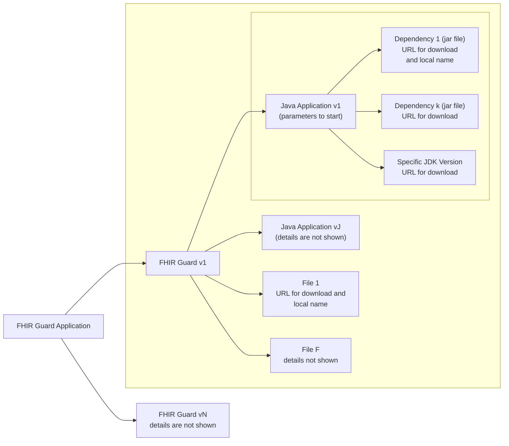

# FHIR Guard (fg) Documentation

## Overview
The `fg` command-line interface (CLI) is a tool for managing and running the FHIR Guard application. It provides a consistent and easy-to-use interface for installing, updating, starting, stopping, and monitoring different versions of this application. By default, `fg` operates in CLI mode, but a graphical interface can be launched by using the `gui` command.

## Getting Started
Quick reference for common operations:

1. Install the latest version: `fg update`
2. Start the application: `fg start`
3. Check status: `fg status`
4. View logs: `fg logs [pid]`
5. Stop application: `fg stop [pid]`


## Requirements
- Supported OS (latest versions of): Windows, macOS, Linux
- Minimum RAM: 2GB
- Storage: 1GB
- Network: outbound HTTP(S) access

## Global options
- `--dir string`: specifies the working directory (can also be set via the `FG_HOME` environment variable).
  - If `FG_HOME` is not set and `--dir` is not provided, the default directory will be the `.fg` directory in the user's home directory.
- `--log-level string`: Sets the log level for the `fg` CLI (`debug`, `info`, `warn`, `error`).
  - Can also be set via the `FG_LOG_LEVEL` environment variable.
- `--help, -h`: Displays help information for any command.

The user's home directory can be identified using the commands below:

| Operating System | Command to Display User's Home Directory |
|------------------|------------------------------------------|
| **Linux**        | `echo $HOME`                             |
| **macOS**        | `echo $HOME`                             |
| **Windows**      | `echo %USERPROFILE%`                     |


## Commands

### Basic commands

#### `fg available`
- Lists all available FHIR Guard versions, regardless of what is installed in the working directory.
- It shows their semantic versioning and release dates.

Example output:

```plaintext
Version     Release Date
--------    ------------
2.0.0       2024-04-05
1.2.0       2024-03-10
1.1.0       2024-02-22
1.0.0       2024-01-15
```

#### `fg gui`
- Launches the graphical user interface.
- The GUI provides access to all `fg` functionality through an interactive and graphical interface.
- Success output: `Graphical interface started successfully.`
- Error output (in red): `Failed to start graphical interface`. In this case, an error message is shown
in the next line (in black).

> **Note**: the GUI requires a graphical environment to be available on your system.

### Installation management

The FHIR Guard application is available in many versions. Each version is a collection of Java applications and files, each with an independent lifecycle and its own version. Each application has dependencies (jar files) and a specific JDK version on which it depends. This relationship can be illustrated as below.



#### `fg install [version]`
- Installs a specific version of the FHIR Guard application.
- Supports semantic versioning only: `x.y.z` (e.g., `1.0.0`, `2.1.3`).
- Creates a default configuration file located at `$FG_HOME/[version]/config.yaml`.
- Success output (in green): `Version [version] installed successfully`.
- Error output (in red): `Failed to install version [version]: [error reason]`.

#### `fg update`
- Checks if a newer version is available than the most recent in `$FG_HOME/`.
- If a newer version exists, downloads, installs it and sets it as the current default.
- Displays:
  - Success output (in green): `Updated to version [new version]. This is now the default version.`
  - No update available: `No newer version available. You have available the latest version: [current version].`
  - Error output (in red): `Failed to update: [error reason]`

> **Note**: internet connectivity is required for the update process to check for and download new versions.

#### `fg uninstall [version]`
- Removes a specific version of the application.
- Requires confirmation: `"Confirm uninstallation of version [version]? (y/N)"`
- Cannot uninstall a running version
- Success output (in green): `"Version [version] uninstalled successfully"`
- Error output (in red): `"Failed to uninstall version [version]: [error reason]"`

#### `fg list`
- Shows all installed versions of the application.
- The most recent installed version is automatically set as the default and marked with an asterisk (*).

Example output:
  ```plaintext
  Installed versions:
  * 1.1.0 (default - most recent)
    1.0.0
    0.9.0
  ```

#### `fg config [version]`
- Displays (read-only) the detailed configuration for a specific version.
- Configuration can only be modified by manually editing the source YAML file located at `$FG_HOME/[version]/config.yaml`.

Example output:
  ```plaintext
  Configuration for version 1.1.0:
  Source file: /home/user/.fg/versions/1.1.0/config.yaml
  
  Current settings (read-only):
  Server:
    - Host: 0.0.0.0
    - Port: 8080
    - Read Timeout: 30s
    - Write Timeout: 30s
  
  Security:
    - TLS: enabled
    - Auth: enabled
    - JWT Expiry: 24h
  
  Resources:
    - Max Memory: 1024MB
    - Max CPU: 2
    - Workers: 10
  
  [...]
  
  To modify these settings, edit the YAML file directly.
  See Configuration Reference for all available options.
  ```

### Application control

#### `fg start [version]`
- Starts a specific version of the application (must be installed first).
- Validates configuration before startup
- Success output (in green): `"Application started successfully. PID: 1234"`
- Error output (in red): `"Failed to start version [version]: [error reason]"`

#### `fg stop [pid]`
- Stops a running instance of the application.
- PID can be obtained from the `fg status` command.
- Graceful shutdown with 10s timeout by default
- Success output (in green): `"Application instance (PID: 1234) stopped successfully"`
- Error output (in red): `"Failed to stop instance: [error reason]"`

### Monitoring and diagnostics

#### `fg status`
- Shows the current status of all running instances of the application.
- Includes details like PID, version, port, uptime, memory usage, CPU usage, and number of tasks.
- Example output:
  ```plaintext
  PID     Version  Port   Uptime   Memory   CPU   Tasks
  1234    1.1.0    8080   2h       256MB    2%    10
  5678    1.0.0    8081   30m      128MB    1%    5
  ```

#### `fg logs [pid]`
- Displays the logs for a specific running instance.
- Supports options:
  - `--tail <n>`: Shows the last `n` lines of the logs.
  - `--follow`: Follows the log output in real-time.
- Logs are stored in the location specified in the `config.yaml` file.

## Configuration

See separate configuration reference for complete details on available settings. Configuration file is located at:
`$FG_HOME/versions/[version]/config.yaml`

Key configuration sections:
- Server settings (host, port, timeouts)
- Security (TLS, authentication)
- Logging configuration
- Resource limits
- Storage settings
- Cache configuration
- Monitoring options
- Cleanup policies

## Installation instructions

### Windows
1. Download the `fg` binary and place it in your desired directory
2. Add installation directory to PATH
3. Verify installation with `fg --version`

### Linux/macOS
1. Download the `fg` binary and place it in your desired directory.
2. Ensure `fg` is in your PATH by adding `export PATH=$PATH:/path/to/fg` to your shell configuration
3. Make binary executable: `chmod +x fg`
4. Verify installation with `fg --version`

## Usage examples
- Launch GUI mode: `fg gui`. Starts graphical and produces at console
  `Graphical interface started successfully.`
- List all versions installed and local of installation: `fg list`
- Install a specific version: `fg install 1.0.0`
- Check for updates: `fg update`
- Show configuration for version 1.0.0: `fg config 1.0.0`
- Start the application: `fg start 1.0.0`
  - Output: `"Application started successfully. PID: 1234"`
- Check the status of running instances: `fg status`
- Monitor the logs for a specific instance: `fg logs 1234 --tail 100`
- Stop a running instance: `fg stop 1234`
  - Output: `"Application instance (PID: 1234) stopped successfully"`
- Uninstall a version: `fg uninstall 1.0.0`

## Error handling
- All commands will return non-zero exit codes on failure
- Error messages are printed to stderr in red
- Use `--help` with any command for additional information

### Common errors and solutions
1. Version not found
  - Check available versions with `fg available`
  - Verify correct version format (x.y.z)

2. Invalid version format
  - Use semantic versioning (e.g., 1.0.0)

3. Instance not running
  - Verify PID with `fg status`
  - Check logs for startup errors

4. Permission denied
  - Run with appropriate privileges
  - Check file permissions in installation directory

5. Port already in use
  - Modify port in config.yaml
  - Check for other running instances

6. Insufficient memory/resources
  - Adjust resource limits in config.yaml
  - Check system resources with `fg status`

## Environment variables
- `FG_HOME`: default installation directory (if not provided, defaults to `.fg` in the user's home directory)
- `FG_LOG_LEVEL`: Log level (debug, info, warn, error) for the `fg` CLI
