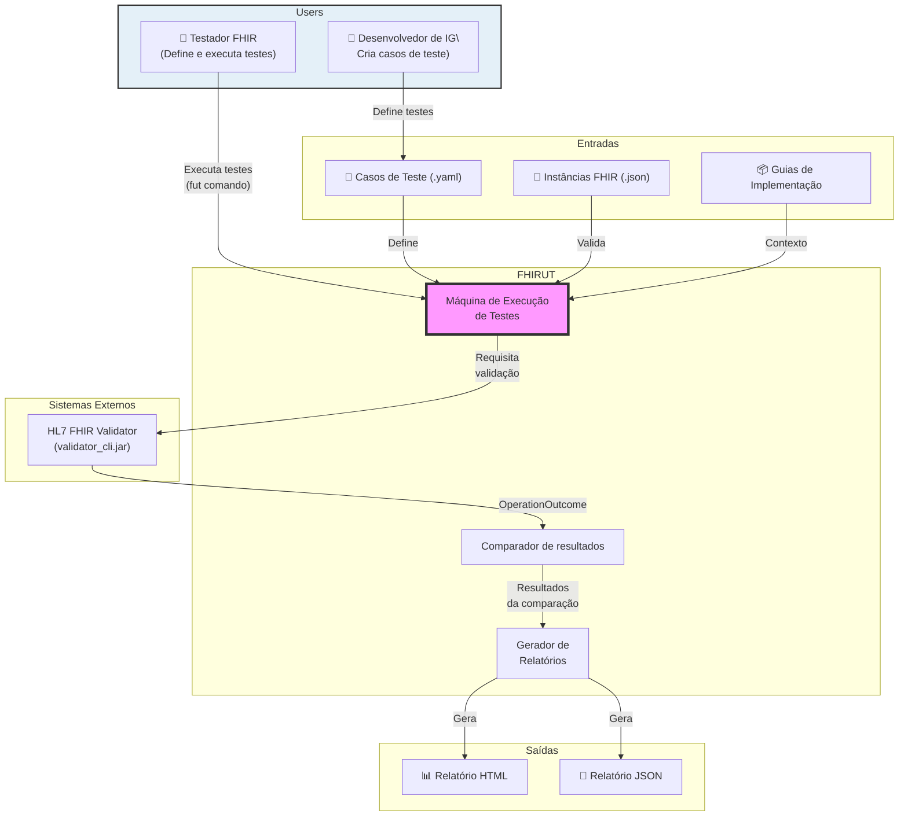

# Visão de contexto

```mermaid
flowchart TB
    subgraph Users
        tester["👤 Testador FHIR<br>(Define e executa testes)"]
        developer["👤 Desenvolvedor de IG\<br>Cria casos de teste)"]
    end

    subgraph "FHIRUT"
        testRunner["Máquina de Execução<br>de Testes"]
        comparator["Comparador de resultados"]
        reporter["Gerador de<br>Relatórios"]
    end

    subgraph "Entradas"
        yamlTests["📄 Casos de Teste (.yaml)"]
        instances["📄 Instâncias FHIR (.json)"]
        igs["📦 Guias de Implementação"]
    end

    subgraph "Sistemas Externos"
        validator["HL7 FHIR Validator<br>(validator_cli.jar)"]
    end

    subgraph "Saídas"
        htmlReport["📊 Relatório HTML"]
        jsonReport["📄 Relatório JSON"]
    end

    tester -->|"Executa testes<br>(fut comando)"| testRunner
    developer -->|"Define testes"| yamlTests

    yamlTests -->|"Define"| testRunner
    instances -->|"Valida"| testRunner
    igs -->|"Contexto"| testRunner

    testRunner -->|"Requisita<br>validação"| validator
    validator -->|"OperationOutcome"| comparator
    
    comparator -->|"Resultados<br>da comparação"| reporter
    reporter -->|"Gera"| htmlReport
    reporter -->|"Gera"| jsonReport

    style testRunner fill:#f9f,stroke:#333,stroke-width:4px
    style Users fill:#e4f0f8,stroke:#333,stroke-width:2px
```