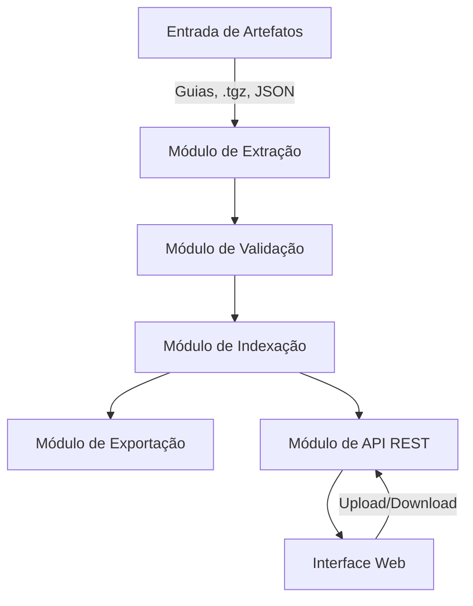
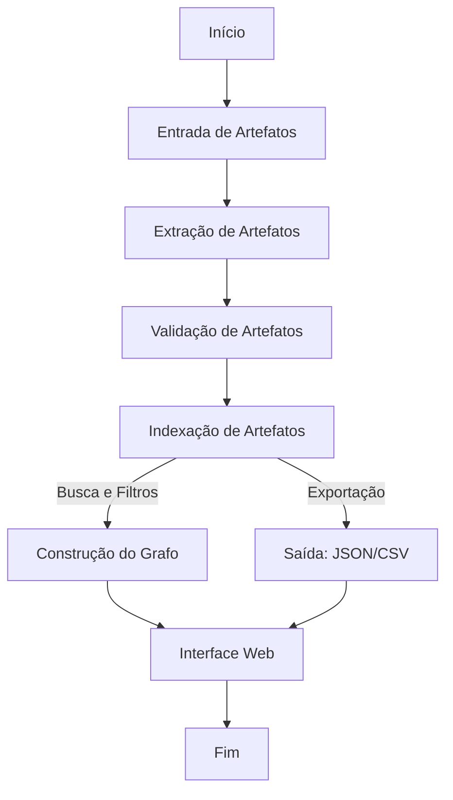

# FHIR Artifact Analyzer

## 1. Visão geral
O **FHIR Artifact Analyzer** é uma ferramenta para identificar, validar e facilitar a consulta acerca de artefatos do padrão FHIR (versão 4.0.1). Estes artefatos podem estar disponibilizadas em uma entrada definida por um conjunto formado por guias de implementação (arquivos .tgz), diretórios e inclusive arquivos, quaisquer um deles disponível localmente ou não.
Algumas das funcionalidades incluem:

- Listagem de artefatos contidos na entrada como instâncias dos recursos `StructureDefinitions`, `CodeSystems`, `ValueSets`, instâncias de recursos e de perfis, dentre outros.
- Validação de URLs canônicas e conformidade com o padrão FHIR. Alguns recursos possuem um atributo **url** por meio da qual é definida a URL canônica ou endereço onde a instância em questão pode ser recuperada.
- Representação das relações entre artefatos em um grafo dirigido. As URLs canônicas e propriedades do tipo [Reference](https://www.hl7.org/fhir/R4/references.html#Reference).
- Exportação de resultados em JSON e CSV.
- Interface via linha de comandos.
- Interface gráfica web para visualização interativa.

_Contexto_. O uso do FHIR é registrado por artefatos em um Guia de Implementação, geralmente um NPM Package (.tgz). Também é possível
que tais artefatos sejam fornecidos em um diretório contendo os arquivos JSON ou até identificados unicamente, arquivo por arquivo. Cada arquivo, 
seja identificado individualmente, contido em um diretório ou arquivo .tgz define um recurso FHIR. Adicionalmente, instâncias de recursos FHIR formam um grafo, 
pois há várias formas de estabelecer [relações](https://www.hl7.org/fhir/R4/references.html) entre elas. Nesse contexto é "fácil se perder", pois são muitos recursos, 
dos mais variados tipos e relações entre eles. Este projeto visa criar uma ferramenta
para facilitar a navegação entre estes artefatos tanto para integradores (consumidores)
quanto para aqueles responsáveis pela criação de perfis FHIR.

O padrão FHIR, versão 4.0.1, está disponível [AQUI](https://hl7.org/fhir/R4/index.html).

## 2. Objetivos
- **Identificar**: localizar todos os artefatos FHIR contidos na entrada fornecida, como guias de implementação, pacotes `.tgz`, arquivos JSON e outras formas.
- **Validar**: Verificar URLs canônicas e conformidade com o padrão FHIR 4.0.1, inclusive duplicidades e outros. 
- **Organizar**: indexar os artefatos para busca eficiente e geração de grafos dirigidos, além de dados estatísticos.
- **Visualizar**: fornecer uma interface via linha de comandos e outra web para explorar os artefatos e suas relações.
- **Exportar**: permitir a exportação dos resultados em formatos JSON e CSV e PNG (grafos).

## 3. Funcionalidades principais

### 3.1 Identificação da entrada
- Itens de entrada:
  - guias de implementação (url canônica do guia)
  - Pacotes `.tgz` (NPM Package).
  - Arquivos .zip contendo artefatos
  - URL para um dos elementos acima.
  - Diretórios (e possivelmente subdiretórios) contendo artefatos.
  - Arquivos individuais indicados.
  - Expressões regulares para seleção de artefatos
- Identificar os artefatos a partir dos itens de entrada:
  - `StructureDefinitions`, `CodeSystems`, `ValueSets`, `Extensions`, etc.
- Extrair e gerar metadados para cada artefato visando apoiar as demais funcionalidades.
- Monitoramento de diretórios e arquivos para sinalizar atualizações, que devem repercutir nos metadados e, na sequência, nas visualizações exibidas, por exemplo.

### 3.2 Validação
- URLs Canônicas:
  - Verificar se as URLs canônicas estão acessíveis.
- Referências
  - Verificar se referências literais (Reference.reference) contidas (internas), relativas ou absolutas estão acessíveis (incluir validação sintática).
  - Verificar se referências literais (Reference.reference) urn:oid e urn:uuid são sintaticamente válidas e se estão acessíveis.
  - Verificar se referência lógica (Reference.identifier) está acessível (caso seja URL).
- Conformidade com FHIR:
  - Validar a estrutura dos artefatos usando o HL7 FHIR Validator.

### 3.3 Busca e Filtros
- Busca global por nome ou sequência de caracteres a ser encontrada no nome dos artefatos, url canônica, comentários, descrições e ou outros elementos relevantes.
- Filtros por:
  - Tipo de artefato.
  - Status de validação.
  - Referências (artefatos referenciados ou referenciadores).

### 3.4 Visualização de Grafo
- Exibir as relações entre artefatos em um grafo dirigido.
- Permitir interatividade:
  - Zoom, pan, seleção para destaque de nós (centralizar) e de conexões.
  - Aplicação de filtros no grafo.

### 3.5 Exportação
- Gerar resultados em:
  - **JSON**: estrutura completa dos metadados.
  - **CSV**: dados tabulares para análise simples.
  - **PNG**: grafo exibido

## 4. Arquitetura do Sistema
### 4.1 Diagrama de Arquitetura Geral


### 4.2 Componentes Principais
1. **Backend**:
   - Linguagem: Java (Spring Boot).
   - Módulos:
     - Extração.
     - Validação.
     - Indexação.
     - Exportação.
     - API REST.
2. **Frontend**:
   - Linguagem: JavaScript/TypeScript.
   - Frameworks:
     - React (interface gráfica).
     - D3.js (visualização de grafos).
3. **Armazenamento**:
   - Local: Arquivos temporários.
   - Nuvem: Banco de dados leve (opcional).

## 5. Fluxo de Processamento
### 5.1 Diagrama de Fluxo


### 5.2 Descrição do Fluxo
1. **Entrada**:
   - O usuário fornece os artefatos (localmente ou via interface web).
2. **Extração**:
   - Identificação e classificação dos artefatos.
3. **Validação**:
   - Verificação de URLs e conformidade com o padrão FHIR.
4. **Indexação**:
   - Organização dos metadados e mapeamento de relações.
5. **Construção do Grafo**:
   - Representação das relações entre artefatos.
6. **Saída**:
   - Geração de arquivos JSON e CSV.
7. **Interface Web**:
   - Exibição interativa dos resultados.


## 6. Requisitos Não Funcionais
- **Desempenho**:
  - Suportar até 10.000 artefatos (~50 MB de dados).
  - Processamento síncrono em tempo real.
- **Internacionalização**:
  - Pronto para múltiplos idiomas (ex.: `en`, `pt`).
- **Portabilidade**:
  - Compatível com execução local e em nuvem.
- **Usabilidade**:
  - Interface intuitiva com feedback visual.


## 7. Estrutura Inicial do Repositório
```plaintext
project-root/
├── backend/
│   ├── extraction/         # Módulo de Extração
│   ├── validation/         # Módulo de Validação
│   ├── indexing/           # Módulo de Indexação
│   ├── export/             # Módulo de Exportação
│   ├── api/                # Módulo de API REST
│   └── config/          # Configurações e arquivos auxiliares
├── frontend/
│   ├── components/         # Componentes React
│   ├── pages/              # Páginas principais
│   ├── services/           # Comunicação com a API REST
│   ├── styles/             # Estilização
│   └── locales/            # Arquivos de idioma
├── docs/                   # Documentação do projeto
├── tests/                  # Testes unitários e de integração
└── docker/                 # Configurações para containerização
```


## 8. Prazos e Milestones
- **Mês 1**:
  - Configuração inicial.
  - Implementação dos módulos de extração e validação.
- **Mês 2**:
  - Implementação dos módulos de indexação, exportação e API REST.
- **Mês 3**:
  - Desenvolvimento da interface web.
  - Testes e refinamentos.


## 9. Contato
Para dúvidas ou sugestões, crie uma *issue* correspondente no presente projeto.


## Onboarding

- Visão geral do FHIR. O que você precisa fazer para colaborar com o projeto (30min).
- Visão geral do projeto (30min).
- Ambientação com FHIR e o projeto.
